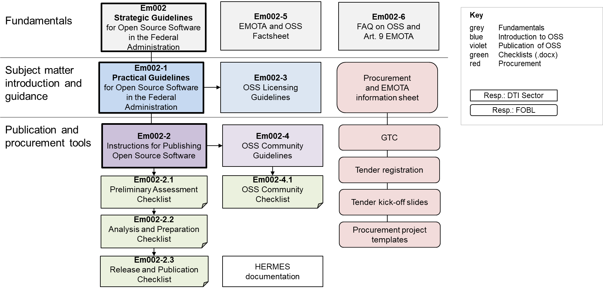

**Disclaimer:** This document is an evolving draft and part of the guidelines and tools designed to support the Federal Administration in publishing open source code. For more information, see the main [README](https://github.com/swiss/opensource-guidelines/tree/main).

---

# Use of these guidelines

Under Article 9 of the Federal Act on the Use of Electronic Means to
Carry Out Official Tasks (EMOTA), the Confederation is required to
disclose the source code of software that it develops or commissions for
the performance of its duties.\[5\] The DTI Sector of the Federal
Chancellery has derived overarching objectives from this legal mandate
in the Strategic Guidelines for Open Source Software.

This document serves as practical guidelines on the legal and strategic
requirements. It is designed to assist federal administrative units in
the use, procurement and release of open source software. It provides
all interested parties with a comprehensive overview of the subject and
refers to additional information in the other resources.

However, depending on your prior knowledge and needs, you may wish to
read the guides selectively before moving on to the other tools. The
following outline will help you find the appropriate starting point. If
you are unsure, it is recommended that you read through the guidelines
first.

The following diagram gives an overview of the documents relevant to OSS
in the Federal Administration.

Figure : Overview of OSS tools in relation to Art. 9 EMOTA

# Definitions

# Potential and challenges

There is enormous potential for open source software in today's world of
IT. At the same time, the use of open source solutions also brings
challenges. These two sides are explained in more detail in the
following section. The information is based on, among other things, the
results of the Open Source Study Switzerland 2018, 2021 and 2024 by the
University of Bern, in which respondents provided information about the
recognised advantages and disadvantages of open source software.

## Potential of open source software

The following points describe the potential that can be realised when
using and releasing open source software.

## Challenges in dealing with OSS

The following describes the typical challenges encountered in practice
with open source software and outlines some possible solutions. We do
not address general challenges that affect all software at this point
(e.g. the need to check for cybersecurity and the need to secure
appropriate support for critical software).

4.  # Constellations for using/working with OSS
    
    1.  ## Overview of OSS constellations

When using and developing OSS in the Federal Administration, there are
various constellations regarding the obligations related to open source
licences:

## Use of unmodified open source software

When using open source software, it is generally not relevant under
which open source licence it is published, as all open source licences
(see Section 2 'Definitions') allow the unrestricted use of open source
software, regardless of how many workstations, simultaneously logged-in
users, number of servers and processors, etc. the software is used on.

When using unmodified open source software, **no publication
obligations** arise even for programs that are under a licence with a
strict copyleft effect (exception: AGPL licence, Affero General Public
Licence).

As long as open source software is introduced and operated by internal
federal service providers, this can be done **without a public
procurement procedure**, because "the OSS licence alone generally costs
the procuring entity nothing and is therefore not relevant to
procurement in itself."18

If an external service provider is commissioned for maintenance, support
and other services for the open source software, the requirements of
public procurement law must be observed. Different support variants are
described in Section 9. It is also important to use appropriate
suitability and award criteria when procuring open source software. The
basis for this is explained in Section 8.

## Development with open source components and release of source code

With the publication obligation according to Art. 9 EMOTA, the procedure
described in *Em002-2 Instructions for Publishing Open Source Software*
should be followed here.  
The documents *[Em002-3 OSS Licensing Guidelines](em002-3.md)* and *Em002-4 OSS
Community Guidelines* must also be consulted if necessary. The goal is
to release the project in a controlled manner using the three checklists
*\[Em002-2.1\], \[Em002-2.2\], \[Em002-2.3\]*.

## Collaboration in open projects (contribution)

Possible considerations for the Federal Administration's contribution to
open, existing projects are listed at
<https://www.bitkom.org/Bitkom/Publikationen/Bitkom-Leitfaden-zu-Open-Source-Software-20.html>
in Section 4.2. Possible considerations for the Federal Administration's
contribution to open, already existing projects are listed in the BITKOM
guide \[BITCOM2024\] Section 4.2.\[22\] Depending on the importance of
the project for the Federal Administration, it should be examined how
much responsibility the respective office wants to and can assume.

Collaboration in open projects and direct development in open projects
can also take place using the documents for release. The focus is on
*[Em002-4 OSS Community Guidelines](em002-4.md)* and the *checklist \[Em002-4.1\]*.

# Properties and selection of open source licences

The properties and selection of open source licences are described in
the document *[Em002-3 OSS Licensing Guidelines](em002-3.md).*

# OSS procurement

This and the following sections deal with the procurement and unchanged
use of open source software. The focus is on the *Procurement and EMOTA
information sheet*,\[23\] which is relevant for IT services and works.
The following are also of interest:

  - Tender registration

  - Tender kick-off slides

  - The document *[Em002-3 OSS Licensing Guidelines](em002-3.md)* may also be useful.

  - The overview of open source software used, released and co-developed
    can also be consulted.

The enterprise readiness of open source can be found in the document
*Selection Criteria for Enterprise-Ready Open Source Software*
\[Gu2024\]\[24\] or in the Bitkom guide\[25\] or at
<https://www.bitkom.org/Bitkom/Publikationen/Bitkom-Leitfaden-zu-Open-Source-Software-20.html>,
Section 3.3.

*Figure* *2: Key documents on OSS procurement in connection with EMOTA
Art. 9*

# Findability of OSS alternatives / solutions

Various platforms allow interested organisations to find and analyse
open source software before use or procurement. The resulting data
provide a basis for deciding on the use or procurement of open source
software.

A compilation of minimum requirements and possibly a market analysis
should serve in any case.

## alternativeTo

A practical tool for finding alternatives to software is 'alternativeTo
- Crowdsourced software recommendations'.\[26\] As the name suggests,
the alternatives and their ratings have been created through
crowdsourcing, i.e. the input of many individual users. alternativeTo
distinguishes four types of software solutions, of which only the first
is considered open source software in the sense of Art. 9 EMOTA:

| **Free open source** | Software that is published under an open source licence.                                                                                                                                                                                                                                                       |
| -------------------- | -------------------------------------------------------------------------------------------------------------------------------------------------------------------------------------------------------------------------------------------------------------------------------------------------------------- |
| **Free**             | Free software (freeware) but whose source code is not freely available and may not be modified.                                                                                                                                                                                                                |
| **Freemium**         | Such software offers a free and a premium version, with all important functionalities already available in the free version. This category does not include software that can be tested free of charge for a certain period of time (e.g. a 30-day trial version), which falls into the 'Commercial' category. |
| **Commercial**       | This is proprietary software for which licence fees are charged when used.                                                                                                                                                                                                                                     |

## Open source repositories

Currently, the world's most popular open source development platform
with over 30 million users and over 100 million source code repositories
is GitHub.\[27\] Today, practically all IT companies, especially
manufacturers of proprietary software, as well as many other types of
company and organisation, have a GitHub presence. More and more public
authorities – about a dozen from Switzerland\[28\] – also publish their
own open source software on 'GitHub and Government' at
<https://government.github.com>. This process can also be carried out
with other repositories.

Examples of other repositories are:

  - GitLab

  - Bitbucket

  - SourceForge

  - LaunchPad

On GitHub Insights, numerous relevant statistics of an Open Source
project on GitHub can be read:

| **Pulse**            | Overview of the recent activities of an open source project on GitHub: Summary of the most important information about development intensity, community heterogeneity, open reports, improvements (pull requests), etc. |
| -------------------- | ----------------------------------------------------------------------------------------------------------------------------------------------------------------------------------------------------------------------- |
| **Contributors**     | Display of which developers have been active and when. This is an important indicator of whether everything depends on one person or whether there is a larger community behind it.                                     |
| **Commits**          | Display of which contributions were made to this open source project in which time period.                                                                                                                              |
| **Code frequency**   | Visualisation of how much source code was added or removed and when.                                                                                                                                                    |
| **Dependency graph** | Dependencies of the open source project on other open source software (e.g. relevant for identifying security vulnerabilities and updates).                                                                             |
| **Network**          | Display of when which developer contributed to which development branch.                                                                                                                                                |
| **Forks**            | List of all copies of the open source project on GitHub. Indicator of the popularity and distribution of the open source software.                                                                                      |

## Open Hub

If information is to be collected on an open source solution that is not
necessarily developed on GitHub, Open Hub by Black Duck is a good
option.\[29\] A wealth of important information is clearly summarised
for around half a million open source projects:

Open Hub also allows you to compare different open source
projects.\[30\] This quickly provides an overview of which project has
the most active community, the longest development time or the most
suitable licence.

## Special code repositories

Larger organisations have their own code repositories. Particularly
noteworthy is, for example, the German repository for authorities
opencode.de.\[31\] Repositories from other public administrations are of
particular interest here.

## OSS Directory

Open Source organisations sometimes maintain directories of interesting
open source software and companies that can support this.  
In Switzerland, this is the OSS Directory of CH Open.\[32\]

# Support models for OSS use

Open source software already available on the market can basically be
used in three ways:

1.  Use without professional support

2.  Use with internal support

3.  Use with support from an external supplier.

These three types of use and their advantages and disadvantages are
briefly explained below. Which of these scenarios makes the most sense
in a particular case must be decided on a case-by-case basis. Which
support model is suitable depends on the strategic relevance of the open
source software, the technical integration and the available personnel
resources.

For critical software, support must be provided professionally in any
case, whether internally or externally. The planned lifecycle should
also play a role in support planning. It may also be that support is
obtained from multiple providers.

## Use without professional support

Open source software is free to download, install and use.

## Use with internal support

A company or public sector organisation builds up expertise and
resources in specific open source solutions for long-term use. This
approach is particularly common in business-critical areas.

## Use with support from external supplier

An external open source provider is brought in to professionally
accompany the rollout and maintenance of the open source software. This
approach is particularly used in business-critical areas where in-depth
know-how of the software must be immediately available. This can also
include parts of or the entire release.

# Contact point

There is no single point of contact in the Federal Administration that
provides information on open source topics. In principle, federal
offices are responsible for implementation themselves.

General enquiries about the OSS tools in the Em002 document set can be
directed to the DTI Sector of the Federal Chancellery:
[opensource@bk.admin.ch](mailto:opensource@bk.admin.ch).

# Annexes

## Changes from previous version

  - References to FITSU removed.

  - The document has been substantially revised and reorganised compared
    to the previous version. The constellations also address the
    creation and handling of open source software.

  - Several parts have been moved to the other supporting documents in
    the Em002 set: e.g. licences, glossary, FAQ.

  - The part on procurement of unmodified software has been taken from
    the FOBL 2015 leaflet.

  - The references have been moved to the strategic guidelines.

  - The sections on potential and challenges, findability of possible
    open source software, support models and business models with OSS
    have remained in the practical guidelines.

## References

The references of the document set Em002 can be found in the *Strategic
Guidelines* Em002.

## Abbreviations

A list of abbreviations can be found in the main document Em002.  
A glossary can be found in the document *Em002-6 FAQ on OSS and Art. 9
EMOTA*.

## Business models with OSS

Open source software is not a business model per se because, unlike with
proprietary software, it is not possible to sell software under an open
source licence. Nevertheless, there are different possibilities for
companies to operate business models based on open source software. For
example, if professional external support is to be obtained for an open
source solution, then the procurement of corresponding commercial
services is necessary. The four most common business models for open
source software are explained below. Additional aspects of these and
other business models are explained in the BITKOM guidelines
\[BIT-KOM2023\].

### D.1 Services and products based on OSS

Companies can offer commercial services such as web hosting or cloud
computing based on open source software, which would be much more
expensive with proprietary software. As a result, most start-ups, online
portals and e-commerce providers today build their platforms on open
source software. Other technology companies such as telecommunications
companies, streaming providers or even manufacturers of proprietary
software integrate open source software into their software and hardware
products as well as online services. This allows companies to continue
to offer innovative solutions that would be difficult to achieve with
proprietary software.

### D.2 Services for OSS

Open source providers provide services for selected open source
software. They have experienced open source developers and can therefore
offer support, maintenance, operation, development, consulting, training
and other services for open source software. These can be obtained from
the open source supplier as a mandate or under a contract for work and
services. Such services for open source software can be publicly
tendered as there is no vendor lock-in. What is important for such
tenders is the consideration of appropriate criteria so that the service
providers that are actually competent are selected (see Sections 0 and
9, \[BITKOM2023\] Section 3.3 and \[Gu2024\]).

### D.3 Subscriptions

If services for open source software are provided in a standardised,
recurring form as a kind of service level agreement (SLA), these are
called subscriptions. As part of such subscriptions, companies
guarantee, for example, continuous security updates, support by email or
telephone, compatibility with other software and hardware products
through certifications, long-term maintenance services and safeguards
against legal claims (copyright, patents). In return, customers pay
subscriptions per workstation or CPU, similar to licence fees or usage
fees for proprietary software. Unlike proprietary software, however,
subscriptions for open source software are not a prerequisite for using
the software, but merely a way of paying for the added value of the
services provided by the open source supplier.

### D.4 Dual licensing

If a company owns the intellectual property of a software solution and
all integrated open source components are under a permissive licence,
then dual or multiple licensing can be applied. This allows the
developer company to publish the software under a copyleft open source
licence and also sell it under a proprietary licence. This commercial
version is often called the Enterprise version and typically includes
certain additional features, such as exclusive interface integrations or
permission for buyers to integrate the software into their own
proprietary products. Depending on the extent of the restrictions of the
open source version, caution is advised when using dual-licensed
software, as obtaining the Enterprise version may be unavoidable, making
the vendor lock-in as high as with typical proprietary software.

1.  Recommendation for Federal Administration IT in accordance with
    \[P035\] *Section 4.6*

2.  > For definitions of the INTERNAL and CONFIDENTIAL classifications,
    > see the Ordinance *of 8 November 2023 on Information Security in
    > the Federal Administration and Armed Forces (InfoSecO; SR 128.1)*

3.  See footnote 1

4.  Planning areas in accordance with the *Federal Administration IT
    Strategy 2020–2023 of 3 April 2020 (SB000)*

5.  [BBl 2023 787 – Federal Act on the Use of Electronic Means to Carry
    Out Official Tasks (admin.ch;
    de)](https://www.fedlex.admin.ch/eli/fga/2023/787/de#art_9)

6.  See <https://en.wikipedia.org/wiki/Free_software>

7.  See <https://en.wikipedia.org/wiki/Proprietary_software>

8.  See <https://opensource.org/>

9.  See: <https://en.wikipedia.org/wiki/Source_code>

10. See: <https://en.wikipedia.org/wiki/Fork_(software_development)>

11. See: <https://en.wikipedia.org/wiki/Contributor_License_Agreement>

12. See: <https://en.wikipedia.org/wiki/Version_control>

13. See: <https://en.wikipedia.org/wiki/Git>

14. See:
    <https://en.wikipedia.org/wiki/Open-source_software_development>

15. See: <https://en.wikipedia.org/wiki/Software_Package_Data_Exchange>

16. We use the definition from \[St2024\]: 'Digital sovereignty of a
    state or organisation necessarily includes complete control over
    stored and processed data as well as independent decision-making
    about who may access it. It further includes the ability to
    independently develop, modify, control and supplement technological
    components and systems.'

17. Another aspect of security is that it is easier to document the
    libraries used (including dependencies) than in proprietary
    software. This in turn means that when vulnerabilities occur, they
    can be quickly identified and fixed (see also SBOM).

18. Project or application managers are responsible for such new
    features. The project determines exactly how this is done. Em002-2
    and Em002-4 help with detailed decisions. Depending on the size of
    the feature, it may not make sense to go through the instructions in
    full. Procurement law aspects for resources must be observed.

19. See <https://www.oss-studie.ch/>

20. https://alternativeto.net/

21. Explanation of the term copyleft in *Em002-3 OSS Licensing
    Guidelines*.

22. See
    <https://www.bitkom.org/Bitkom/Publikationen/Bitkom-Leitfaden-zu-Open-Source-Software-20.html>
    in, Section 4.2.

23. Information sheets for the FOBL procurement units can be found in
    the corresponding toolbox (in German):
    <https://intranet.bbl.admin.ch/bbl_kp/de/home/informatik/beschaffung-buerotechnik-informatik-des-bbl/werkzeugkasten.html>

24. See \[Gu2024\]

25. See
    <https://www.bitkom.org/Bitkom/Publikationen/Bitkom-Leitfaden-zu-Open-Source-Software-20.html>,
    Section 3.3

26. <https://alternativeto.net/>

27. <https://octoverse.github.com>

28. <https://government.github.com/community/#switzerland>

29. <https://www.openhub.net/>

30. <https://www.openhub.net/p/_compare>

31. <https://opencode.de/de>

32. <https://www.ossdirectory.com/en/home>
